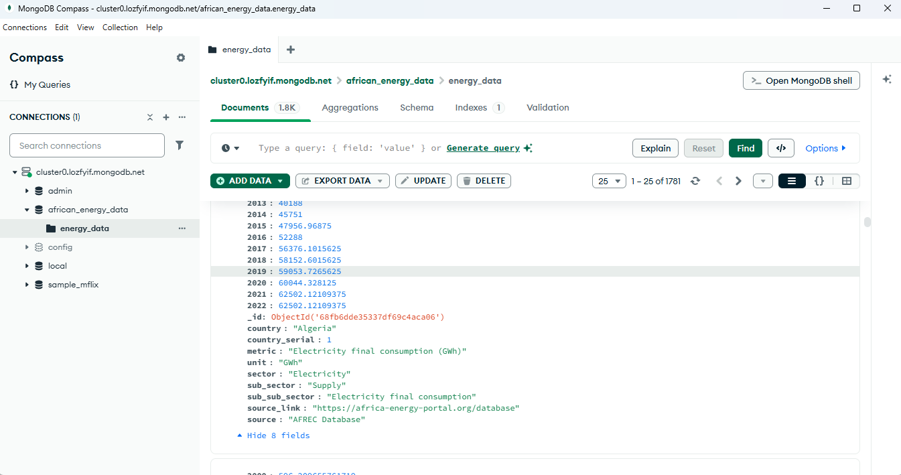

# ⚡ African Energy Data Scraper (2000–Present)

This project automates the **scraping, preprocessing, and storage** of **energy-related data** from the **[African Energy Portal (AEP)](https://africa-energy-portal.org/)**.  
It retrieves structured indicators — such as electricity generation, consumption, renewables, and access rates — covering **2000 to the present**, then stores them in a **MongoDB database** for analysis and visualization.

---

## 📚 Table of Contents
1. [Overview](#-overview)
2. [Features](#-features)
3. [Project Structure](#-project-structure)
4. [Setup Instructions](#️-setup-instructions)
5. [Environment Variables](#-environment-variables)
6. [Workflow Summary](#-workflow-summary)
7. [MongoDB Integration](#-mongodb-integration)
8. [Chrome/Brave Launcher Configuration](#-chromebrave-launcher-configuration)
9. [Sample Outputs](#-sample-outputs)
10. [Troubleshooting](#-troubleshooting)
11. [Future Improvements](#-future-improvements)
12. [License](#-license)

---

## 📖 Overview

The **African Energy Data Scraper** automatically extracts energy-related statistics from the **African Energy Portal** (AEP) and organizes them into a clean, analysis-ready format.

It includes scripts for:
- Scraping and collecting raw data (JSON format)
- Preprocessing and cleaning data into CSV (wide format)
- Uploading the final dataset into MongoDB

The result is a structured, time-series dataset ideal for **data analysis, dashboards, and machine learning models**.

---

## ✨ Features

✅ Automated scraping from the African Energy Portal  
✅ Time range: **2000–present**  
✅ Saves raw JSON responses for reproducibility  
✅ Preprocessing into wide-format CSV for modeling  
✅ Automatic upload to MongoDB collection  
✅ Supports switching between **Chrome** and **Brave** browser launchers  
✅ Secure `.env` configuration for MongoDB credentials  

---

## 🗂 Project Structure
```
African_Energy_Scraping/
│
├── requirements.txt # Python dependencies
├── .env # Environment variables (excluded in .gitignore)
├── README.md # Documentation (this file)
│
├── notebooks/
│ ├── energy.ipynb # Notebook for exploration or visualization
│ ├── aep_preprocessed_wide_2000_2022.csv # Processed dataset
│ └── scraped_json/ # Folder for storing raw scraped JSON files
│
└── Scripts/
├── main.py # Entry point – runs scraping, preprocessing, upload
├── scrape_aep.py # Handles web scraping from AEP
├── preprocess_aep.py # Cleans and reshapes data
├── upload_to_mongo.py # Uploads final dataset to MongoDB
├── aep_preprocessed_wide_2000_2022.csv # Processed dataset
└── scraped_json/ # Backup of raw API/HTML JSON responses
```

---

## ⚙️ Setup Instructions

### 1️⃣ Clone the Repository
```
git clone https://github.com/<your-username>/African_Energy_Scraping.git
cd African_Energy_Scraping
```

### 2️⃣ Create and Activate a Virtual Environment  
```
cd African_Energy_Scraping
python -m venv venv
source venv/bin/activate       # macOS/Linux
venv\Scripts\activate          # Windows
cd African_Energy_Scraping
```
### 3️⃣ Install Dependencies
```
pip install -r requirements.txt
```
### 4️⃣ Configure Environment Variables

Create a .env file in the project root with the following structure:
```
MONGO_URI=<your_mongodb_connection_string>
MONGO_DB=<your_database_name>
MONGO_COLLECTION=<your_collection_name>
```
**⚠️ Note:**
Never share your .env file or push it to GitHub.  
It’s already included in .gitignore for security.

⚡ Workflow Summary

The project follows a three-step automated process:

**Step	Script	Description**  
- 1️⃣	scrape_aep.py	Scrapes energy data (2000–present) from AEP and stores raw JSON files in scraped_json/.   
- 2️⃣	preprocess_aep.py	Cleans and transforms the JSON data into a wide-format CSV file (aep_preprocessed_wide_2000_2022.csv).  
- 3️⃣	upload_to_mongo.py	Uploads the cleaned dataset to MongoDB using credentials from .env.  

All three scripts can be executed sequentially using the main script:
```
python Scripts/main.py
```

## 🗄 MongoDB Integration

The scraper connects to MongoDB using PyMongo.  
Each record contains structured time-series data by country, indicator, and year.  




To verify the data insertion:  
```
python Scripts/upload_to_mongo.py
```

Example output:
```
✅ Successfully uploaded 55 documents to MongoDB collection: energy_data_2000_2022
```
## 🌐 Chrome/Brave Launcher Configuration

The scraper can use either Chrome or Brave for automated browser-based scraping.
To switch between them:

Option 1: Chrome (default)
```
driver = webdriver.Chrome(executable_path="path/to/chromedriver")
```
Option 2: Brave

Update your scrape_aep.py file to use Brave’s launcher:
```
options.binary_location = "C:/Program Files/BraveSoftware/Brave-Browser/Application/brave.exe"
driver = webdriver.Chrome(options=options)
```
### 🧩 Handling Missing or Null Values

During preprocessing, some yearly values in the scraped dataset may appear as null, NaN, or missing.  
These represent cases where data was not available for a given country, year, or metric on the African Energy Portal.  

**🧠 Why They Occur**

The source data for specific years or indicators might be missing or incomplete.  

Some indicators may not apply to all countries or sectors.  

Scraping interruptions or page structure changes could cause partial extraction.  

**✅ Recommended Solutions**

You can handle missing values depending on your analysis goal:  

- __Leave as Null (Recommended for Merging with Other Time Series)__

When datasets are later merged by year, it’s best to keep nulls as-is.

This ensures alignment across datasets without artificially inflating values.

```
df = df  # Keep missing as NaN (pandas default)
```

- __Forward/Backward Fill (If Trend Continuity is Needed)__ 

Propagate the last known valid observation forward:  
```
df.fillna(method='ffill', inplace=True)
```

Or backward:
```
df.fillna(method='bfill', inplace=True)
```

- __Replace with Zero (When Nonexistent Data = Zero Output)__

For supply/production metrics, you may optionally fill missing values with zero.
```
df.fillna(0, inplace=True)
```

- __Interpolate Missing Years (For Time-Series Smoothing)__

Estimate missing values based on neighboring years:
```
df.interpolate(method='linear', inplace=True, axis=1)
```
**🧠 Tip:** 
Ensure your ChromeDriver or BraveDriver version matches your browser version.

📊 Sample Outputs

1️⃣ Preprocessed CSV Preview:


| country | country_serial | metric                                         | unit           | sector      | sub_sector | sub_sub_sector                | source_link                                                        | source         | 2000    | 2001    | 2002    | ... | 2022     |
| ------- | -------------- | ---------------------------------------------- | -------------- | ----------- | ---------- | ----------------------------- | ------------------------------------------------------------------ | -------------- | ------- | ------- | ------- | --- | -------- |
| Algeria | 1              | Electricity export (GWh)                       | GWh            | Electricity | Supply     | Electricity export            | [African Energy Portal](https://africa-energy-portal.org/database) | AFREC Database | 319.0   | 196.0   | 259.0   | ... | 1529.34  |
| Algeria | 1              | Electricity final consumption (GWh)            | GWh            | Electricity | Supply     | Electricity final consumption | [African Energy Portal](https://africa-energy-portal.org/database) | AFREC Database | 18592.0 | 19664.0 | 20739.0 | ... | 62502.12 |
| Algeria | 1              | Electricity final consumption per capita (KWh) | KWh per capita | Electricity | Supply     | Per Capita                    | [African Energy Portal](https://africa-energy-portal.org/database) | AFREC Database | ...     | ...     | ...     | ... | ...      |

## 📄 License

This project is licensed under the MIT License — you’re free to use, modify, and distribute it with attribution.  

👨‍💻 Author: Maryam Babu 
📅 Updated: November 2025  
🌍 Project: African Energy Scraper — Data for a Sustainable Future  
